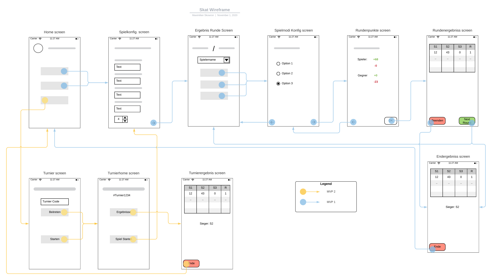

# UI Planung

Während der Planung der Nutzeroberfläche wurde folgender Pretotype erstellt:

Der Pretotype zeigt die einzelnen Bildschirme der App und wie man zwischen ihnen wechselt.
Die Pfeile fungieren dabei als Verlaufselemente und weisen einzelne Bildschirme bzw. Funktionen einem MVP zu.

Besonders wichtig war die Farbkodierung einiger Elemente, wie z.B. der "Beenden" und "Nächste Runde" Schaltflächen.
Dem Nutzer sollte vermittelt werden, dass eine Interaktion mit der "Beenden" Schaltfläche zwangsläufig zu einem Ende des Spielablaufs führte.