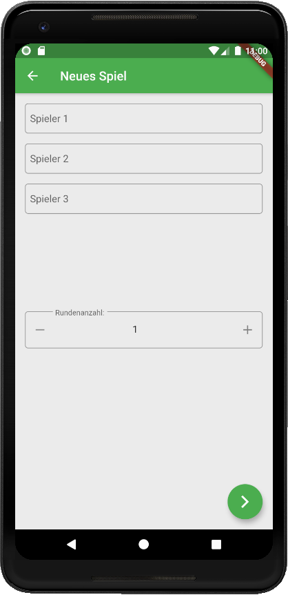

# Skatify Code mit Flutter

## Struktureller Aufbau der App

Innerhalb des `lib` Ordners befinden sich alle Dateien bezüglich der UI und der Funktion der App. Folgende Ordnerstruktur wurde verwendet:

```bash
.
├── configs
│   ├── routes.dart
│   └── service_locator.dart
├── main.dart
├── models
│   ├── game.dart
│   └── player.dart
├── services
│   └── game_service.dart
├── viewmodel
│   ├── gameconfigprovider.dart
│   └── roundresultprovider.dart
└── views
    ├── fallbackview.dart
    ├── gameconfigview.dart
    ├── homeview.dart
    └── resultroundview.dart
```

Der `views` Ordner beinhaltet die einzelnen Bildschirme, welche im Wireframe definiert wurden.
`Viewmodel` ist der Ordner welche die Flutter Provider hält, welche quasi die ViewModels von Flutter sind. 
Dort wird der State gemanagt und verschiedene Services integriert und ausgeführt.
Die Services sind im `services` Ordner zu finden.
Services beinhalten Logik, wie der `GameService` welcher Models bezüglich des Spiels und der Spieler hält und zum starten, stoppen von Spielen zuständig ist.
Entsprechende Models sind im `models` Ordner zu finden.

Unterhalb des `configs` Ordner existieren globale Konfigurationsobjekte.
Die Datei `routes.dart` definiert Pfade innerhalb der App, also verschiedene Bildschirme und ermöglicht es anderen Bildschirmen in den nächsten zu wechseln.
Der Service Locator hingegen ist ein Tool, welches das erstellen von Factories und Singeltons vereinfacht.
Es werden nun nicht mehr direkt Services instanziert, sondern mittels dem Service Locator geholt.
Dieser abstrahiert z.B. das Erstellen von Singletons weg, sodass z.B. im `GameService` keinerlei Code erstellt werden muss, um zu garantieren, dass nicht zwei Instanzen erstellt werden.

`main.dart` stellt den Eingangspunkt der App dar.

```dart
import .....

void main() {
  // setup and initialize locator bevore app starts to prevent calls before init
  setupLocator();
  runApp(MyApp());
}

class MyApp extends StatelessWidget {
  @override
  Widget build(BuildContext context) {
    return MultiProvider(
      providers: [
        ChangeNotifierProvider(
            create: (_) => GameConfigProvider(getIt.get<GameService>())),
        ChangeNotifierProvider(
            create: (_) => RoundResultProvider(getIt.get<GameService>())),
      ],
      child: MaterialApp(
        title: 'Skatify',
        debugShowCheckedModeBanner: true,
        theme: ThemeData(
          primarySwatch: Colors.green,
          visualDensity: VisualDensity.adaptivePlatformDensity,
        ),
        onGenerateRoute: onGenerateRoute,
        initialRoute: '/home',
      ),
    );
  }
}
```

Hier werden mittels eines `MultiProvider` die verschiedenen Provider bereitgestellt und ihnen wird der `GameService` übergeben, welcher vom Service Locator als Singleton erstellt wurde.

Danach wird eine `MaterialApp` angelegt, diese gibt allen Widgets unterhalb ein Material Aussehen.
Des Weiteren wird mit der Material App eine Funktion angegeben `onGenerateRoute`, welche die Wege zwischen den Bildschirmen handhabt.

## Provider am Beispiel der GameConfigView

Innerhalb der `onGenerateRoute` wird das `GameConfigView` Widget aufgerufen und erzeugt.

```dart
Route<dynamic> onGenerateRoute(RouteSettings settings) {
  switch (settings.name) {
    case Routes.HomeRoute:
      return MaterialPageRoute(builder: (context) => HomeView());
    case Routes.GameRoute:
      return MaterialPageRoute(
          builder: (context) => GameConfigView(
                playerCount: settings.arguments,
              ));
    case Routes.ResultRoundRoute:
      return MaterialPageRoute(builder: (context) => ResultRoundView());
    default:
      return MaterialPageRoute(builder: (context) => FallbackView());
  }
}
```

Die Home View selbst sieht so aus:

```dart
class GameConfigView extends StatelessWidget {
  final int playerCount;
  final double _roundMin = 1;
  final double _roundMax = 20;

  GameConfigView({this.playerCount, Key key}) : super(key: key);

  @override
  Widget build(BuildContext context) {
    final _prov = Provider.of<GameConfigProvider>(context);
    _prov.playerCount = playerCount;

    return Scaffold(
      backgroundColor: Colors.grey[200],
      resizeToAvoidBottomInset: false,
      appBar: AppBar(
        title: Text("Neues Spiel"),
      ),
      floatingActionButton: FloatingActionButton(
        onPressed: () {
          _prov.startGame();
          Navigator.pushNamed(context, Routes.ResultRoundRoute);
        },
        child: Icon(Icons.arrow_forward_ios),
      ),
      body: Padding(
        padding: EdgeInsets.all(16),
        child: Column(
          mainAxisSize: MainAxisSize.max,
          children: [
            Flexible(
              child: ListView.builder(
                itemCount: this.playerCount,
                itemBuilder: (ctx, i) {
                  return _PlayerSelectWidget(i);
                },
              ),
            ),
            Flexible(
              child: SpinBox(
                value: _prov.roundCount,
                onChanged: (newValue) {
                  _prov.roundCount = newValue;
                },
                decoration: InputDecoration(
                  labelText: "Rundenanzahl:",
                  border: OutlineInputBorder(
                    borderRadius: BorderRadius.circular(5),
                  ),
                ),
                min: _roundMin,
                max: _roundMax,
              ),
            ),
          ],
        ),
      ),
    );
  }
}

class _PlayerSelectWidget extends StatelessWidget {
  final int number;

  _PlayerSelectWidget(this.number);

  @override
  Widget build(BuildContext context) {
    final _prov = Provider.of<GameConfigProvider>(context);

    return Container(
      padding: EdgeInsets.only(bottom: 16),
      child: Column(
        crossAxisAlignment: CrossAxisAlignment.start,
        children: [
          TextField(
            onChanged: (s) {
              _prov.setName(s, number);
            },
            decoration: InputDecoration(
              contentPadding: EdgeInsets.only(left: 8),
              labelText: "Spieler ${number + 1}",
              border: OutlineInputBorder(
                borderRadius: BorderRadius.circular(5),
              ),
            ),
          ),
        ],
      ),
    );
  }
}
```

Die View ist ein `StatelessWidget` und hält somit keinerlei State, da dieser in den Provider ausgelagert wurde.
`StatefullWidgets` werden oft in Verbindung mit Animationen verwendet, da diese nicht vom Provider gemanagt werden.

Das Root Widget ist ein sogenanntes Skaffold.
Dieses stellt verschiedene typische Elemente, wie eine Top Navigationsbar, einen Floating Action Button oder auch eine Bottom Navigationsbar zur Verfügung.

Mit der Zeile `final _prov = Provider.of<GameConfigProvider>(context);` wird den Widgetbaum nach oben gegangen bis zum `MultiProvider` wo schließlich der `GameConfigProvider` initialisiert wird.

Dieser beinhaltet Variablen, zu den einzelnen Spielern und der Rundenanzahl.
Die entsprechenden Felder können mit Settern und Gettern gesetzt werden.
Der Provider, welcher durch einen `ChangeNotifier` dargestellt wird, updated die UI jedes Mal wenn die Funktion `notifyListeners()` aufgerufen wird. Woraufhin alle Widget, welche solche Werte nutzen neugebaut werden.

```dart
class GameConfigProvider extends ChangeNotifier {
  double _roundCount = 1;
  List<String> _names = [];
  GameService gs;
  int _playerCount;

  GameConfigProvider(this.gs);

  set playerCount(int c) {
    _playerCount = c;
  }

  set roundCount(double newValue) {
    _roundCount = newValue;
    notifyListeners();
  }

  double get roundCount => _roundCount;

  void setName(String name, int i) {
    if (_names.length == 0) {
      for (int i = 0; i < _playerCount; i++) {
        _names.add("");
      }
    }

    _names[i] = name;
  }

  // will use the singleton gameservice to create a game
  // provide all values to gameservice
  void startGame() {
    gs.startGame(_roundCount.toInt(), _names);
  }
}
```

Der Game Config Bildschirm sieht dann so aus:

